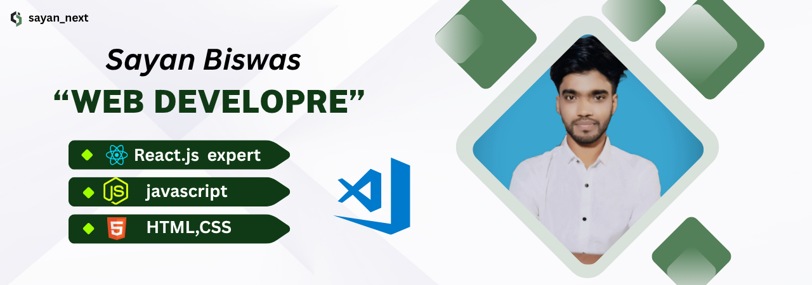

<<<<<<< HEAD


<h1 align="center">Hi there, I'm Sayan Biswas 👋</h1>
<h3 align="center">💻 A Passionate Frontend Web Developer from Bangladesh</h3>

<p align="center">
  
</p>

---

### 🚀 About Me

- 🔭 I’m currently building _beautiful UI templates & real-world projects_
- 🌱 I’m currently learning _MongoDB | Express.js | Next.js_
- 👯 I’m open to freelance work, team collaboration, and startup ideas
- 🧠 Interested in _AI-integrated Web Apps_
- 📫 Contact me: *sayanbi098@gmail.com*
- 🌐 Portfolio: [yourportfolio.com](https://yourportfolio.com)
- 🧳 Resume: [View CV](https://your-resume-link.com)

---

### 🛠 Skills & Tools

_Languages:_  


  


_Frontend:_  


  


_Backend & DB:_  
  
  


_Tools & Platforms:_  


  


---

### 📂 Featured Projects

| Project                    | Tech Stack        | Live                                 |
| -------------------------- | ----------------- | ------------------------------------ |
| _Modern Portfolio Website_ | React + Tailwind  | [View](https://yourportfolio.com)    |
| _E-commerce UI Template_   | React + Bootstrap | [View](https://yourproject.com)      |
| _Form Template Pack_       | React + Formik    | [View](https://gumroad.com/yourform) |

---

### 🌐 Connect With Me

[](https://linkedin.com/in/yourusername)  
[](https://twitter.com/yourhandle)  
[](mailto:sayanbi098@gmail.com)

[](https://www.youtube.com/@nextwebbysayan)
[](https://www.facebook.com/share/16VW9hSZto/)

---

### 📊 My GitHub Stats

<!-- Top languages used -->


<!-- Basic stats -->


<!-- Contribution streak (even small activity will show progress) -->


<!-- Profile views -->

## 

### 🧠 Fun Fact

```txt
I love creating things that help others,
and I believe coding is the new superpower!
```
=======
## Hi there 👋

<!--
**sayan-biswas01/sayan-biswas01** is a ✨ _special_ ✨ repository because its `README.md` (this file) appears on your GitHub profile.

Here are some ideas to get you started:

- 🔭 I’m currently working on ...
- 🌱 I’m currently learning ...
- 👯 I’m looking to collaborate on ...
- 🤔 I’m looking for help with ...
- 💬 Ask me about ...
- 📫 How to reach me: ...
- 😄 Pronouns: ...
- ⚡ Fun fact: ...
-->
>>>>>>> bd055f0cf66f213a0467e6269b655f7e6eb4db22
